# Data on SDCC
## (formerly RACF (even earlier RCF))
*Jakub Češka*  


## Quick Glossary 

- **Run** - a period of several months in a year when the accelerator conducts collisions
  - e.g., Run17 - acceleration that took place (started) in 2017

- **run** - approximately 30-minute interval when data is collected; separated
  - e.g., 17319001 (first run of Run17)

- **collision type** - collision system and center-of-mass energy
  - e.g., pp 510GeV, AuAu 54GeV 

- **picoDst, MuDst** - format of stored data
  - most newer data primarily uses picoDst (newer format)

- **production** - specific data production, there can be several
  - e.g., P20ic

- **library** - version of STAR software with which the data was produced
  - e.g., SL22b

- **data stream** - type of data that the dataset contains
  - e.g., st_physics

- **Trigger** - triggering mechanism that identifies "interesting" collisions
  - e.g., BHT1*VPD30, BHT2*BBCMB

- **storage** - where a specific file is stored; we know 3 types:
  - *local* - distributed disks (on a specific server), we use xrootd for access
  - *NFS* (network file storage) - shared disks, we can access directly
  - *HPSS* (high performance storage system) - tape storage, relevant for "more exotic" or older data
< -- 
> "Analyze 500 GeV proton-proton data from Run17, select BHT1 trigger. Find their luminosity for me."

## Act 1

### How to Access the Data

## Directory for data-related things


[Production (drupal page)](https://drupal.star.bnl.gov/STAR/comp/prod)

Directory containing links to pages where information about individual data can be found

## Data for Physical Analysis - Overview

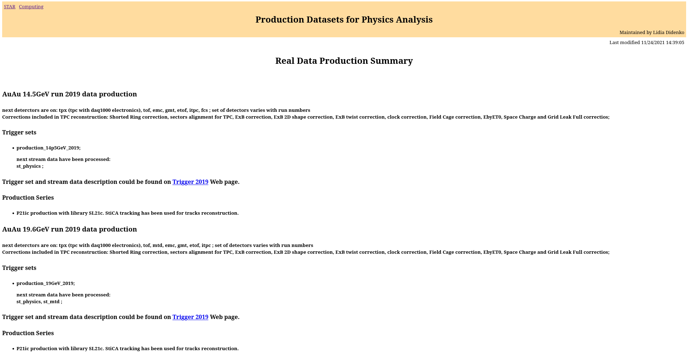

[Production Datasets for Physics Analysis](https://www.star.bnl.gov/public/comp/prod/ProdList.html)

List and brief description of datasets. Contains information about detectors used for data collection, trigger setups, list of individual data streams, link to the trigger page, list of individual production streams

## Data for Physical Analysis - Example


[Production Datasets for Physics Analysis](https://www.star.bnl.gov/public/comp/prod/ProdList.html)

List and brief description of datasets. Contains information about detectors used for data collection, trigger setups, list of individual data streams, link to the trigger page, list of individual production streams

## Act 2

### How to Work with Triggers

## List of Triggers - Overview

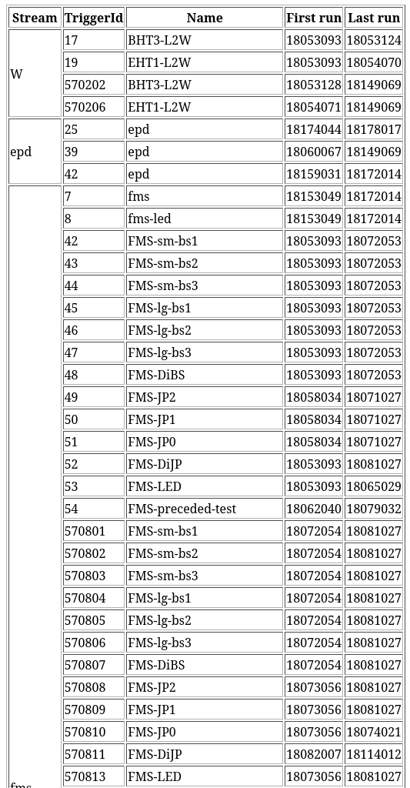

[Trigger 2017](https://www.star.bnl.gov/protected/common/common2017/trigger2017/streams.html)

List of individual triggers, their IDs (those used in analysis) and which data stream they are in, the first and last run during which the given trigger was used

"Production triggers" are typically designated by a 6-digit number (if there is only 1 or 2 digits, it's a test trigger from the beginning of the Run - not used)

Triggers sometimes have multiple components - *component1*\**component2*

E.g., BHT1 (energetic hit in the calorimeter) * VPD30 (vertex placed within 30 centimeters from the detector center in the beam direction)

## List of Triggers - Physics

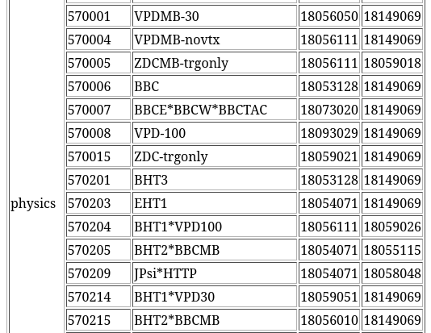

[Trigger 2017](https://www.star.bnl.gov/protected/common/common2017/trigger2017/streams.html)

List of individual triggers, their IDs (those used in analysis) and which data stream they are in, the first and last run during which the given trigger was used

"Production triggers" are typically designated by a 6-digit number (if there is only 1 or 2 digits, it's a test trigger from the beginning of the Run - not used)

Triggers sometimes have multiple components - *component1*\**component2*

E.g., BHT1 (energetic hit in the calorimeter) * VPD30 (vertex placed within 30 centimeters from the detector center in the beam direction)

## INTERLUDE

### RunLog Browser

## STAR Online

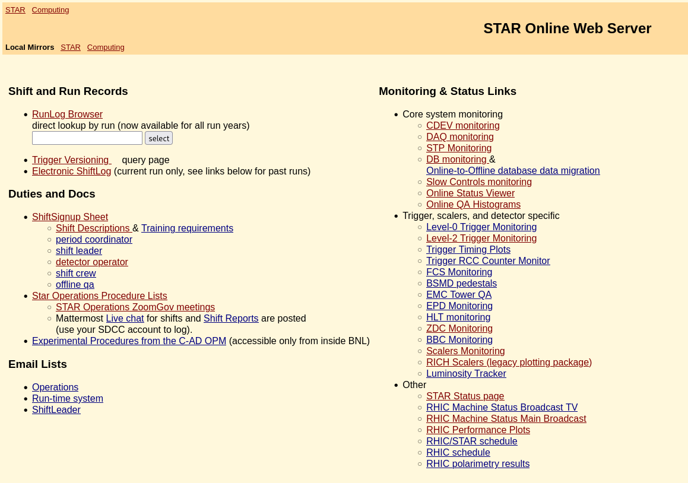

[STAR Online](https://online.star.bnl.gov/)

## RunLog Browser - Introduction

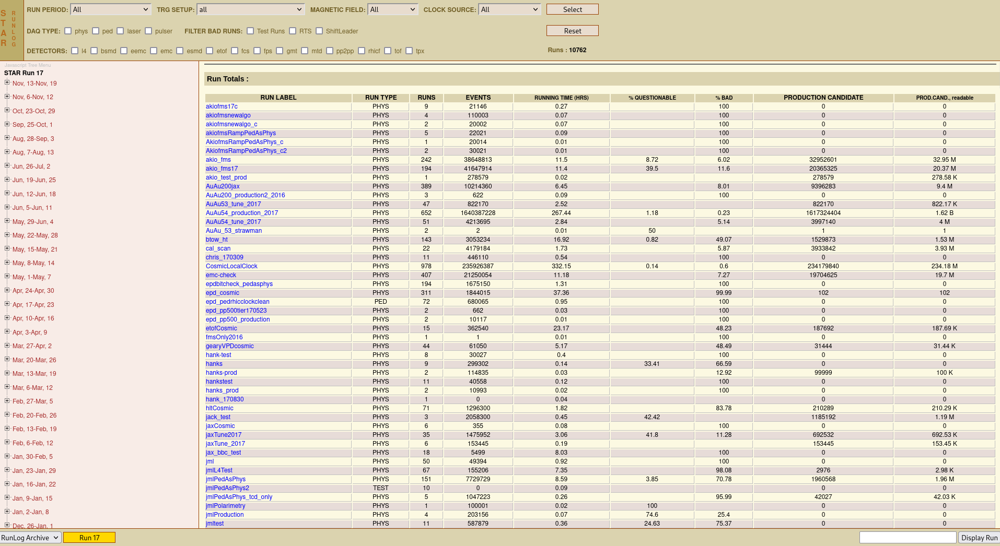

[STAR RunLog Browser](https://online.star.bnl.gov/RunLog/)

## RunLog Browser - Triggers

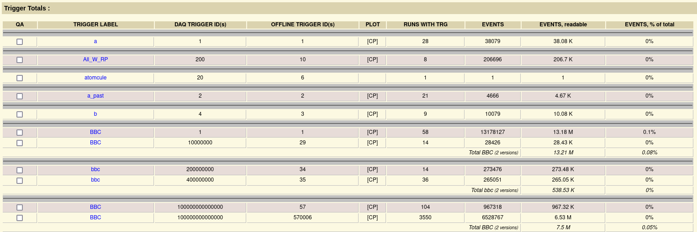

[STAR RunLog Browser](https://online.star.bnl.gov/RunLog/)

## Act 3

### Luminosity - What? Why? How?

## Luminosity - Introduction

- Luminosity - "the ratio of the number of detected collisions $dN$ over time $dt$ and the cross-section ($\sigma$)"

```math
L = \frac{1}{\sigma} \frac{\mathrm{d}N}{\mathrm{d}t}
```

- Used to characterize the performance of the accelerator (number of collisions per unit time)

- Typically has dimensions [b⁻¹ s⁻¹]

- Integrated luminosity is important
```math
L_\mathrm{int} = \int L \mathrm{d}t
```

## Luminosity - Advanced
```math
L = \frac{kN^2f}{4\pi \sigma_x^2 \sigma_y^2}
```
- k - number of bunches in the accelerator
- N - number of particles in a bunch
- f - revolution frequency
- σ - beam size at the collision point

## How to Access Luminosity 1/4


↓


## How to Access Luminosity 2/4

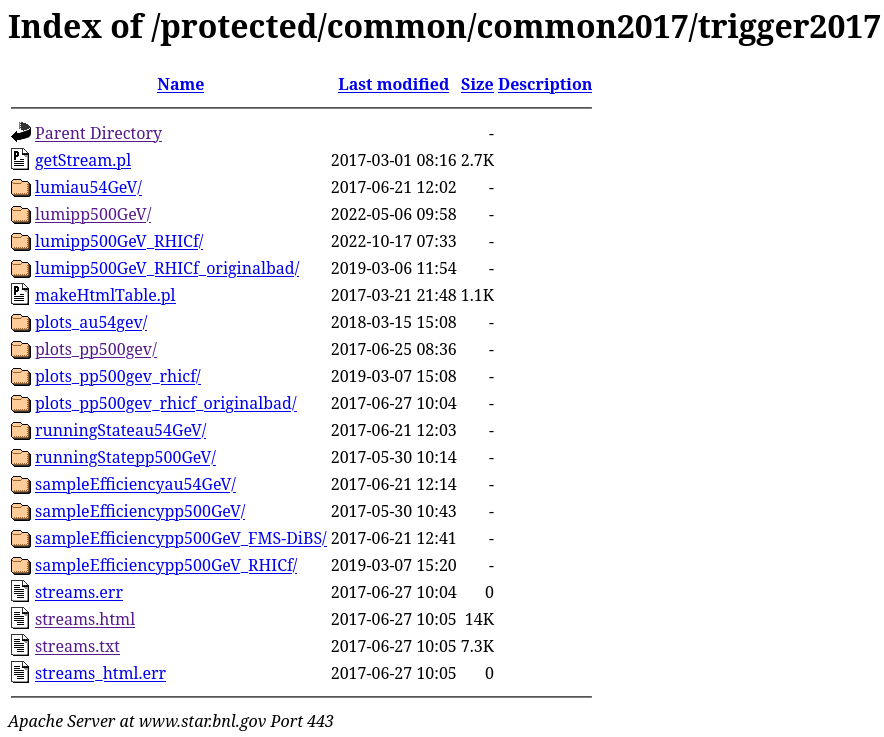

## How to Access Luminosity 3/4


## How to Access Luminosity 4/4

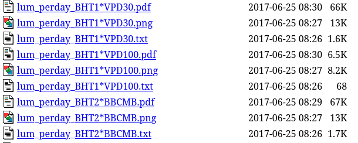

## We Have Luminosity!

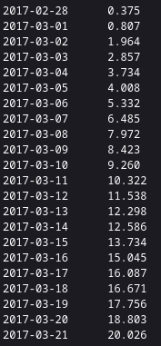


## Conclusion

### The Path to Data

## get_file_list.pl - Briefly

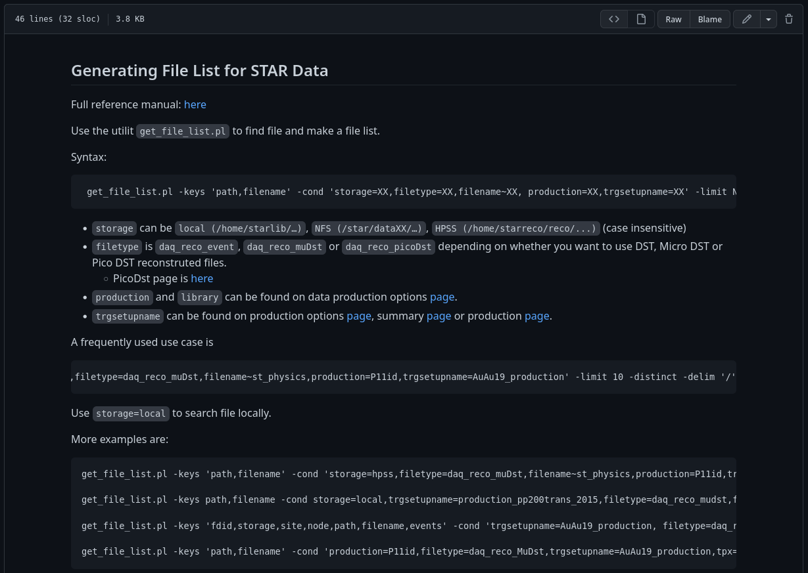

[Generating File List for STAR Data](/how-tos/get_file_list.md)

## get_file_list.pl - Documentation

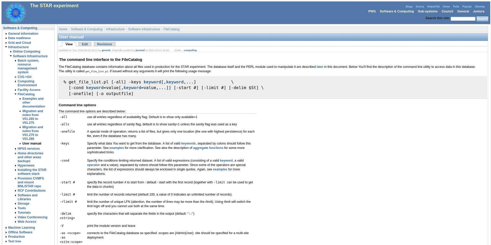

[The command line interface to the FileCatalog](https://drupal.star.bnl.gov/STAR/comp/sofi/filecatalog/user-manual)